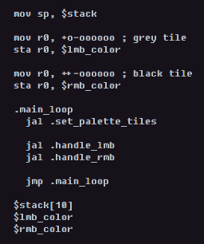

# 

VINE is an in-browser ternary fantasy console where you write actual assembly language.

#### documentation

- [Ternary](ternary.md)
- [CPU & instruction set](cpu.md)
- [Assembler](assembler.md)
- [Memory map](memory.md)

#### specifications

VINE is roughly based on the 4th generation of consoles:

- 9-trit word size
- 243x243 display
- [9k work ram](memory.md)

#### who is it for?

VINE is intended for people who:

- Want to learn assembly language
- Are interested in trying balanced ternary in practice
- Like [PICO-8](https://www.lexaloffle.com/pico-8.php) but want to write assembly instead / don't want to spend $14.99

#### acknowledgments

- [The Ternary Manifesto][manifesto] of Douglas W. Jones
- Retro Game Mechanics Explained's [SNES Features series][snes-features]
- Donald Knuth - called balanced ternary "perhaps the prettiest number system of them all" in [TAOCP]

[manifesto]: https://homepage.divms.uiowa.edu/~jones/ternary/
[TAOCP]: https://wikipedia.org/wiki/The_Art_of_Computer_Programming
[snes-features]: https://www.youtube.com/playlist?list=PLHQ0utQyFw5KCcj1ljIhExH_lvGwfn6GV
